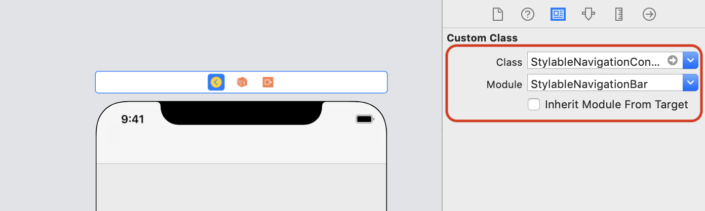

# StylableNavigationBar
[](https://cocoapods.org/pods/StylableNavigationBar)
[](https://cocoapods.org/pods/StylableNavigationBar)
[](https://cocoapods.org/pods/StylableNavigationBar)


> 🧸 **StylableNavigationBar** provide a lightweight replacement for a standard **UINavigationController**, so you can easily manage your **navigation and status bar styles** throughout your iOS app

## Example

To run the example project, clone the repo, and run `pod install` from the Example directory first.

## Requirements

iOS 11, Swift 5

## Installation

1. StylableNavigationBar is available through [CocoaPods](https://cocoapods.org). To install
it, simply add the following line to your Podfile:

```ruby
pod 'StylableNavigationBar'
```

2. Replace class for your UINavigationController to **StylableNavigationController**. If you are using Storyboard, you can change it using the Inspector at the right side of the Xcode:



3. If you creating navigation controller from code you can do it same way as when you create a normal UINavigationController:

```swift
let navigationController = StylableNavigationController(rootViewController: childViewController)
```

4. Define preffered bar style for child view controller by making its extension:

```swift
// MARK: Bar Style
extension ViewController: NavigationBarStylable {
    
    var navigationBarStyle: NavigationControllerStyle? {
        return .darkTinted(tintColor: .black)
    }
}
```

5. Done.

## Navigation Bar Styling

#### There are two ways to define navigation bar style
1. Use predefined *NavigationControllerStyle* like `.darkTinted` `.lightTinted` and specify a tint color:

```swift
// MARK: Define Navigation Bar Style
extension ViewController: NavigationBarStylable {
    
    var navigationBarStyle: NavigationControllerStyle? {
        return .lightTinted(tintColor: .lightGray)
    }
}
```

2. Create your own style (e.g. `AppMainNavigationBarStyle`) conforming to `NavigationBarStyleProtocol`:

```swift
// MARK: Default Navigation Bar Style
struct AppMainNavigationBarStyle: NavigationBarStyleProtocol {
    var barColor: UIColor? = UIColor(named: "defaultBarColor")
    var tintColor: UIColor = UIColor(named: "defaultTintColor") ?? UIColor()
    var statusBarStyle: UIStatusBarStyle = .lightContent
}

class ViewController: UIViewController {
    var barStyle: NavigationBarStyleProtocol = AppMainNavigationBarStyle()
}

// MARK: Define Navigation Bar Style
extension ViewController: NavigationBarStylable {
    
    var navigationBarStyle: NavigationControllerStyle? {
        return .custom(style: barStyle)
    }
}
```

## Roadmap

- [x] Handle iOS 11 NavigationController's largeTitle
- [ ] Add an ability to define image as a navigation bar's background
- [ ] Allow to define title styles (e.g. two lines title etc.)

## Author

Pavlo Chernovolenko, [Linkedin](https://www.linkedin.com/in/pchernovolenko/)

*I will appreciate your contribution in case you have any ideas how to improve the component. Please raise issues if something is not working as expected.* 

## License

StylableNavigationBar is available under the MIT license. See the LICENSE file for more info.
